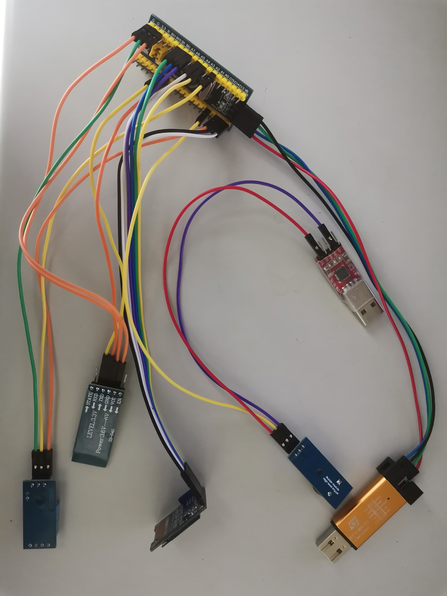
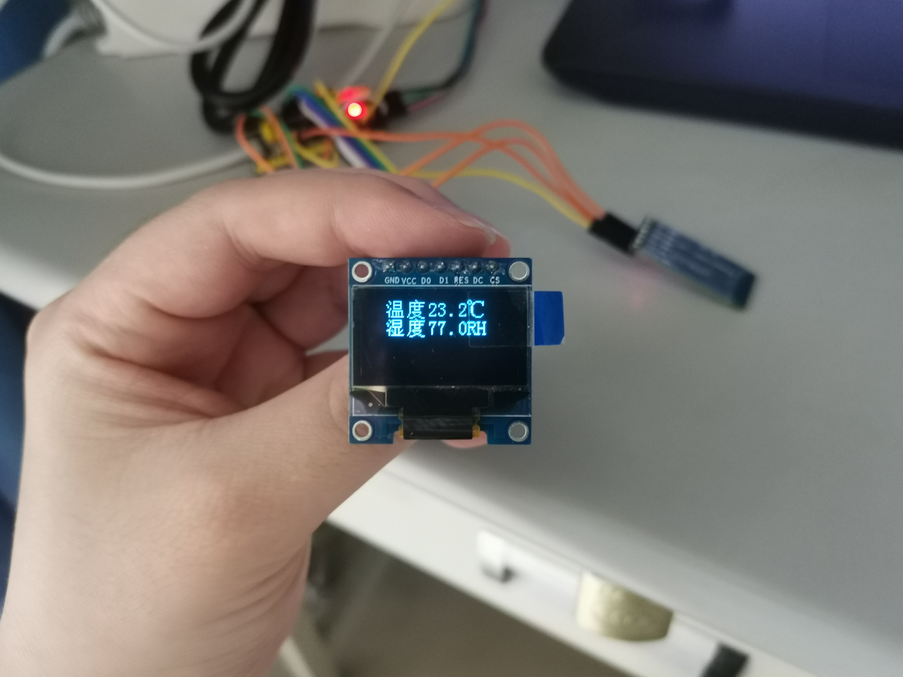
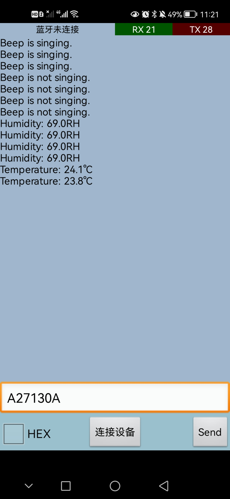
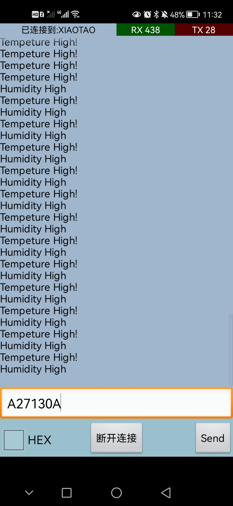
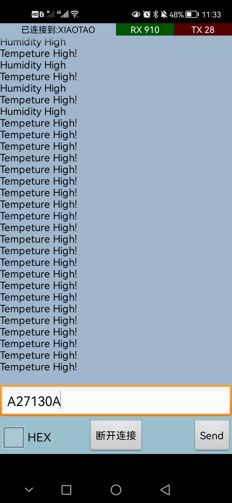

# 嵌入式 - 温湿度测量报警系统

## 一、实验设备

- STM32芯片面板

- ST-Link V2

- 蜂鸣器（ I/O ---> PB8）

- 温湿度传感器（DATA ---> PA2）

- OLED显示屏（D0 ---> PA5, D1 --->PA7, RES --->PB0, DC ---> PB1, CS --->PA4）

- 蓝牙模块（RXD ---> PA9, TXD ---> PA10）

- 带有蓝牙的手机（HarmonyOS版本2.0.0）

- USB TO TTL 

由于STM32芯片面板上GND和VCC都被占用了，借用USB TO TTL上的电源和接地。

## 二、通信协议

建立通信协议ASCII码发送，ASCII码接收。

| 名称            | 含义  | 数值                                             |
| --------------- | ----- | ------------------------------------------------ |
| 帧头 Head       | A     |                                                  |
| 帧类型 Type     | 1   2 | 1代表控制蜂鸣器；2代表读取温湿度                 |
| 桢长度 Length   | 7     |                                                  |
| 数据1 Data_High | 1   2 | 1代表蜂鸣器响/查看温度；2代表蜂鸣器不响/查看湿度 |
| 数据2 Data_Low  | 3   5 | 待定                                             |
| 校验位 Jiaoyan  | 0   2 | 本产品暂不使用                                   |
| 帧尾 Tall       | A     |                                                  |

## 三、程序框图

图1 温湿度测量报警系统程序框图

## 四、程序说明

连接线路（如图1），启动设备后，OLED显示屏显示当前的温度和湿度（如图2）

<table><tr>
<td>
     
图2 线路连接
</td>
<td>
      
图3 OLED显示
</td>
</tr></table>

打开蓝牙，以ASCII格式发送命令（如图3）。

| 命令（ASCII码发送） | 触发操作                                            |
| ------------------- | --------------------------------------------------- |
| A17130A             | 蜂鸣器响；手机蓝牙串口显示“Beep is singing”。       |
| A17230A             | 蜂鸣器不响；手机蓝牙串口显示“Beep is not singing”。 |
| A27130A             | 手机蓝牙串口显示当前温度。                          |
| A27230A             | 手机蓝牙串口显示当前湿度                            |

<table><tr>
<td>
     
图4 命令结果截图
</td>
<td>
      
图5 报警截图01
</td>
<td>
     
图6 报警截图02
</td>
</tr></table>

当温度或湿度超过一定阈值后，系统会自动报警。即蜂鸣器响，手机蓝牙串口显示“Tempeture High!"或”Humidity High!"。

注意：当系统发出高温或高湿警报时，请立即前往现场处理，系统不再接受蓝牙发来的查询命令。警报不解除，蜂鸣器一直响，直至环境条件恢复正常。（实验截图见图5-6）
