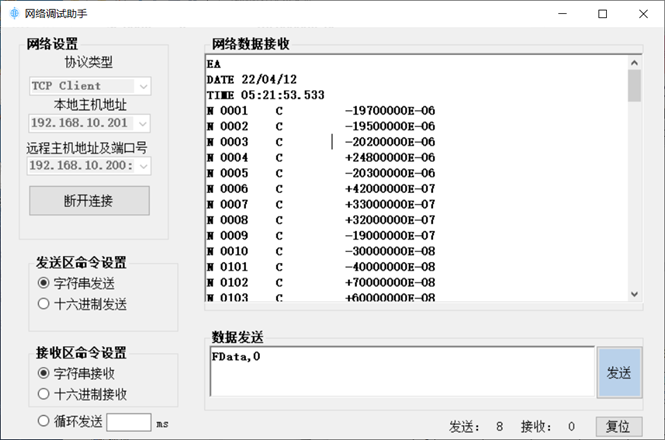

# IOT_LAB11 有线网络传感设备数据采集

## 一、通信协议

GM10数据采集系统的每个GX90XA-10-U模拟输入模块，可连接10个热电偶温度传感器，每台GM10可连接6个GX90XA-10-U模块。在电冰箱等家用电器产品测试时，热电偶温度传感器用来感知电冰箱内的温度。GM10采用的是网络通信，与计算机之间通过以太网连接，按照socket通信进行数据交换。在socket连接中GM10 作为TCP/IP的服务端，计算机作为TCP/IP的客户端。在通信前需要对GM10 设置IP地址和端口号，默认IP地址192.168.2.1，默认端口34434。

GM10 的通信协议中，数据查询命令为：FData,0<crlf>（<crlf>表示回车符+换行符，十六进制为0D 0A）。GM10 接收到命令后返回传感数据，返回数据格式如下所示：

```c#
EA<crlf>
DATE_yy/mo/dd<crlf>
TIME_hh:mm:ss.mmmt<crlf>
s_cccca1a2a3a4uuuuuuuuuufddddddddE-pp<crlf>
… s_cccca1a2a3a4uuuuuuuuuufddddddddE-pp<crlf>
EN<crlf>
```

数据格式说明：

- EA 数据起始符；
- DATE_yy/mo/dd数据日期( 年、月、日)；
- TIME_hh:mm:ss.mmm数据时间( 时、分、秒、毫秒)；
- t 预留(空白)；
- s 数据状态（N标准、D差值输入、S不使用、O溢出、E错误、B断偶）；
- cccc通道号，即传感器在GM10种的编号；
- a1a2a3a4 报警状态（H上限报警、L下限报警、h差值上限报警、空白无报警）；
- uuuuuuuuuu单位( 固定10字符。左对齐输出，不足10字符的部分输出空白。)；
- f 符号(+ 或-)；
- dddddddd尾数部分(00000000 ～ 99999999，8 位)；
- E科学计数法（指数为10的倍数）；
- pp指数部分(00 ～ 05)；
- EN数据结束符；
- 每一行以回车+换行作为结束符。

<div align=center>

</div>

## 二、程序说明

编写数据采集软件，通过网络接口采集GM10 仿真传感设备数据，获取通道1至通道100的温度传感数据后，把通道1至通道8的数据进行解析写入TXT文本文件，每次采集的数据在文件中占据一行， 每行的开头为采集数据的时间格式为“YY-MM-DD,hh:mm:ss:ms”，如17-03-26,15:28:32.255。生成的传感数据文档里显示格式为“YY-MM-DD,hh:mm:ss:ms 数据1；数据2；数据3；数据4；数据5；数据6；数据7；数据8；”。时间与数据间以空格分开，数据之间用分号“;”隔开，采集8 个通道的数据为一行，数据无单位。每500ms 采集一次，10s 共采集20 次数据，生成文档里共显示20 行。

## 三、实验步骤

1. 将仿真器与计算机用网线相连，计算机共有两个网口，计算机自身的网口用于连接服务器，另一网口通过USB-网口转换器扩展实现，
   仿真器连接的是USB-网口转换器的扩展网口。

   <div align=center>
   
   </div>

2. 打开仿真器桌面上的“实验系统”文件夹，运行“gm10”快捷方式，仿真器屏幕显示GM10仿真设备。

   在仿真GM10设备上点击右键，设置IP地址和通信端口号，GM10作为socket通信的服务端。（注：在设置IP 地址之前，请先查看所要连接计算机的IP地址，输入的IP地址，应与要连接计算机处于同一个网段，即IP地址的前个字段应与计算机的IP 地址相同。）

3. 使用“网络助手”软件，获取GM10仿真设备的数据，在计算机上打开网络调试助手，协议类型选择TCP Client，本地主机地址选择实验计算机的IP地址，远程主机地址输入刚刚第二步设置的仿真GM10的IP地址和端口号，在网络数据发送区输入获取GM10数据的命令
   “FData,0”，点击发送，在网络数据接收区会显示仿真GM10返回的数据，确保硬件通信线路正常。

4. 对数据采集程序进行调试。
