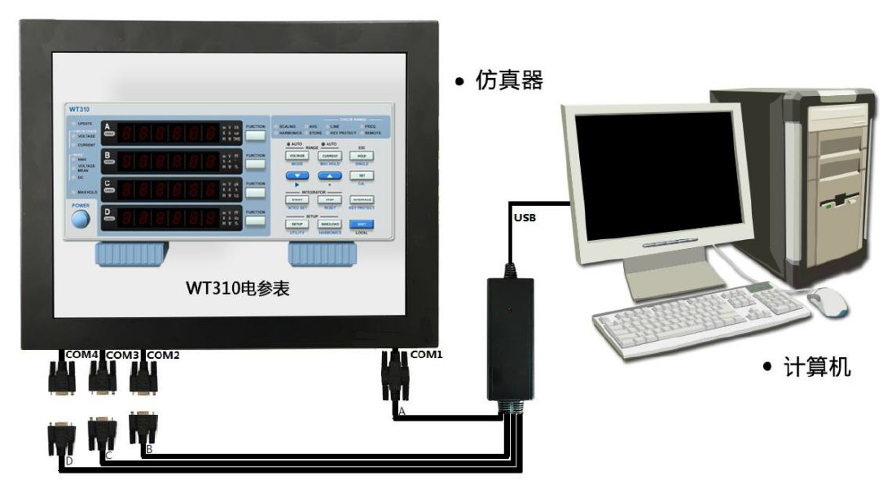

# IOT_LAB9 串行通信传感设备数据采集

## 一、通信协议

WT310 数据获取命令为“:NUMeric:NORMal:VALue?”，命令后面以回车符+换行符（十六进制0D 0A)为命令结束符。WT310 接收到命令后会返回测试数据，如：$103.79E+00,1.0143E+00,105.27E+00,50.001E+00,655.27E+00,0.27E+00$，各参数以“,”作为分隔符，分别对应**电压、电流、功率、频率、耗电量、功率因数**，其数值以科学计数法方式表示（$E$表示指数，$E$前面的数值乘以$10$ 的$n$次幂，$n$为$E$后面三位字符串代表的数值，如：$105.27E+00$ 表示$105.27\times10^0$，仍然为$105.27$）。

## 二、程序说明

编写数据采集程序，通过串口获取WT310 仿真传感设备的电压、电流、功率和耗电量传感数据，把解析后的数据写入TXT文本文，每次采集的数据在文件中占据一行，每行的开头为采集数据的时间格式为“YYYY-MM-DD,hh:mm:ss”，如2017-03-26,15:28:32。生成的传感数据文件里显示格为“YYYY-MM-DD,hh:mm:ss 数据1;数据2;数据3;数据4;数据5;数据6;”。数据顺序为**电压；电流；功率；频率；耗电量；功率因素；**时间与数据间以空格分开，数据之间用分号“;”隔开，每1000ms 采集一次，10s 共采集20 次数据，生成文档里共显示20 行。

## 三、实验步骤

1. 将仿真WT310 与计算机用串口通信线相连。

   

   
   

2. 打开仿真器桌面上的“实验系统”文件夹，运行“WT310”快捷方式，仿真器屏幕显示WT310 仿真设备，用鼠标点击仿真设备的“power” 按钮(电源开关)，仿真设备开始工作。

   点击INTERFACE 键，进行通信参数设置，**默认设置为数据格式：For0，波特率：9600，结束符：Cr+LF**。数据格式有四种，分别为：

   - For0(数据位8；停止位1；校验位NONE);
   - For1(数据位7；停止位1；校验位ODD);
   - For2(数据位7；停止位1；校验位EVEN);
   - For3(数据位7；停止位2；校验位NONE)。
   
波特率可以选择**1200、2400、4800、9600、19200、38400** 六种。命令结束符有三种，**Cr+LF（回车加换行）；Cr（回车）；LF（换行）**。

3. WT310 数据获取命令为“**:NUMeric:NORMal:VALue?<CR+LF>**”，利用计算机桌面上串口助手软件进行通信调试，确保硬件通信线路正常。

4. 对数据采集程序进行调试。
